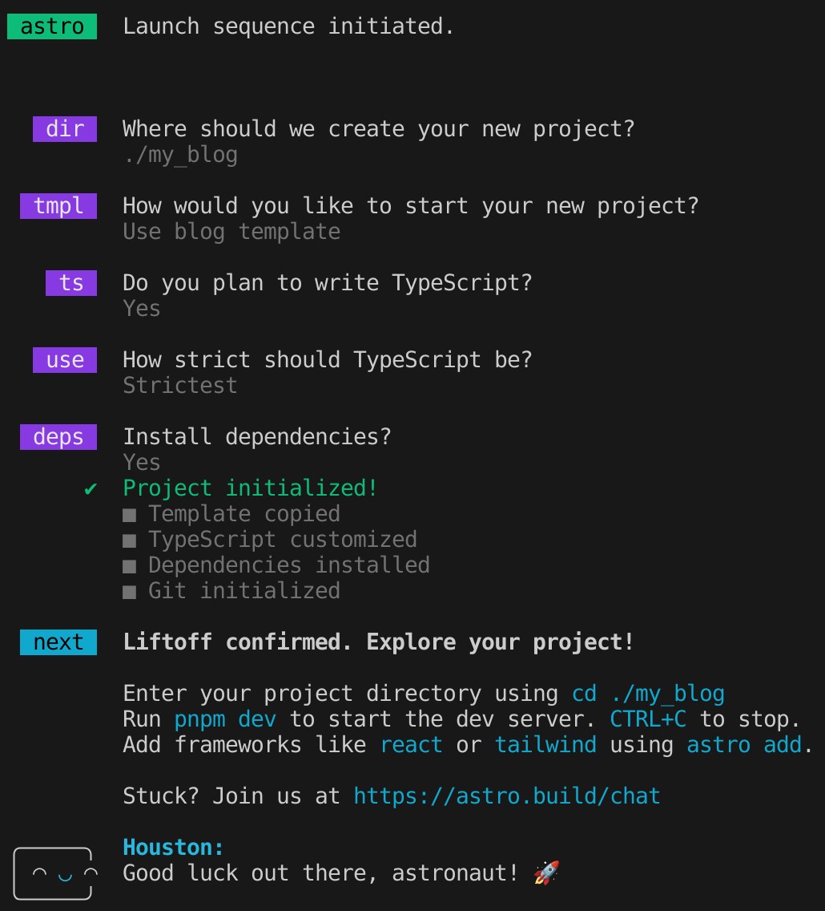

Lately I've been wanting to get some stuff out of my head, and decided to have a personal
blog. From time to time I will put here more and more posts about what I've been thinking
lately.

Alongside that, I've always wanted to create a personal website hosted on Github pages,
and eventually post some ideas I want to share.

How I created a blog in 3 days, but with this information, you simply might do it in one.

### Blog features

The first thing that I like to do before any project is to annotate what are the minimum
requirements that the project needs. For me, those are the ones I wanted for my blog:
- A front page with job info
- A about page with social media links and info about me
- A tech and a personal blog page
- Blog posts should support [markdown](https://en.wikipedia.org/wiki/Markdown)
- Blog posts should support coding snippets
- Should be simple and practical to create and add posts
- Optionally, a dark theme
- Optionally, the possibility to add some custom code

Following the K.I.S.S. (keep it simple stupid) principle, and in an attempt to not follow
the "social media" trends, there is no need for "counters" here. No thumbs up, no comments,
just distraction-free content.

Although comments could be nice, I think it's double-edged in terms of advantages, and a
complicated thing to implement. I intend to publish my posts on other websites as well,
so any comments there are welcome.

### Implementation decisions

I think that for a dev like me, a [SSG](https://en.wikipedia.org/wiki/Static_site_generator)
website hosted on GH pages is very nice. It's free and has all the infrastructure that GH
already offers. No need for any fancy [CMS](https://en.wikipedia.org/wiki/Content_management_system)
or anything, besides, I want to be able to add some code in a blog post, and that would be
a pain to solve in any CMS, and at the end it would be the same results but with more
effort.

Trying to find an SSG website generator, I've found a few candidates for the job. There are tons
of frameworks for that nowadays: [Jekyll](https://jekyllrb.com/), [Gatsby](https://gatsbyjs.com),
[Hugo](https://gohugo.io/) and many others. Any of them would suffice, but I wanted to take
a look on [Astro](https://astro.build).

It's very simple to start a markdown blog with Astro. This post assumes that you already know
how to use [node](https://nodejs.org/en) and [pnpm](https://pnpm.io/). If you don't, don't be
afraid, simply install them on your machine using their docs and follow this on. Astro's docs
already have [some info](https://docs.astro.build/en/tutorial/0-introduction/) on how to do
this step by step.

I will try to do a short summary to speed this up for you:

```sh
cd my-blog-dir
pnpm create astro@latest
```

Choose the blog template option, then you can choose the others as you like.


#### Static analysis

#### Code snippets

#### Content

##### Index and about page

##### Personal and tech blogs

##### Fav icon

#### Automatic deployment / CI / CD

#### Light / dark themes and customization

[Contrast checker](https://coolors.co/contrast-checker/84bae6-000000)

#### SEO

##### Compressing output

##### Optimizing images

#### Markdown improvements
##### External links

#### Custom domain

[Github domain tutorial](https://docs.github.com/en/pages/configuring-a-custom-domain-for-your-github-pages-site/managing-a-custom-domain-for-your-github-pages-site)

#### View transitions

#### PWA / Offline usage

#### Conclusions