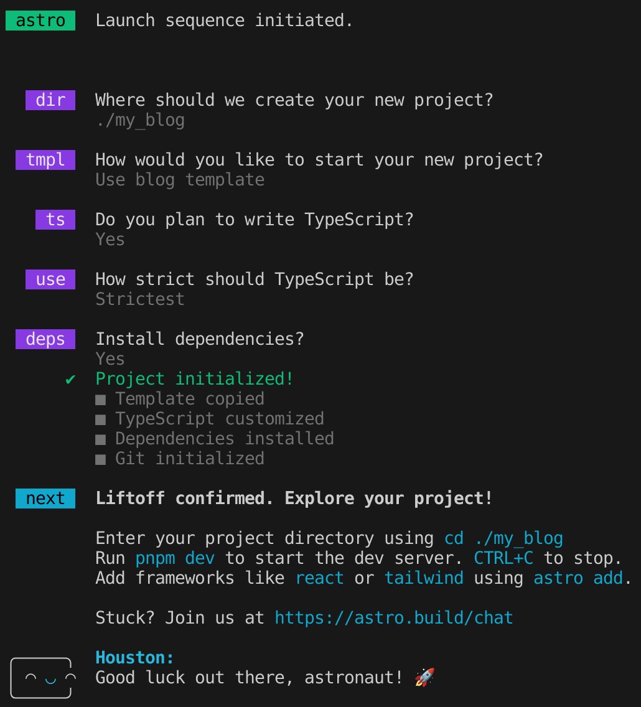
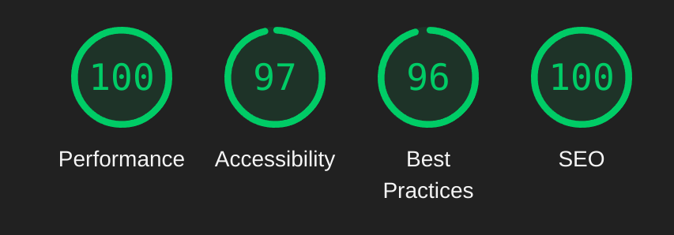

Lately I've been wanting to get some stuff out of my head, and decided to have a personal
blog. From time to time, I will put here more and more posts about what I've been thinking
lately.

Alongside that, I've always wanted to create a personal website hosted on GitHub pages,
and eventually post some ideas I want to share.

With this attempt, I wanted to see if writing a blog from scratch is easier today than writing
one blog post. Let's see.

How I created a blog in 4 days, but with this information, you simply might do it in one.
Note that the temptation to lose time tinkering this blog is immense. I suggest you follow
these guidelines and call it version 1, focus on the content, as I am doing the same from
now on. You can always improve things in the long term.

Astro's default is already nice, you can simply follow **"Blog features"**, **"Content"**
and **"Deploy"**. The rest is up to you.

#blog #astro #kiss #ssg

### Blog features

The first thing that I like to do before any project is to annotate what are the minimum
requirements that the project needs. For me, those are the ones I wanted for my blog:
- A front page with job info
- A about page with social media links and info about me
- A tech and a personal blog page
- Blog posts should support [markdown](https://en.wikipedia.org/wiki/Markdown)
- Blog posts should support coding snippets
- Should be simple and practical to create and add posts
- Optionally, a dark theme
- Optionally, the possibility to add some custom code

Following the K.I.S.S. (keep it simple stupid) principle, and in an attempt to not follow
the "social media" trends, there is no need for "counters" here. No thumbs up, no comments,
just distraction-free content.

Although comments could be nice, I think it's double-edged in terms of advantages, and a
complicated thing to implement. I intend to publish my posts on other websites as well,
so any comments there are welcome.

### Implementation decisions

I think that for a dev like me, a [SSG](https://en.wikipedia.org/wiki/Static_site_generator)
website hosted on GH pages is very nice. It's free and has all the infrastructure that GH
already offers. No need for any fancy [CMS](https://en.wikipedia.org/wiki/Content_management_system)
or anything, besides, I want to be able to add some code in a blog post, and that would be
a pain to solve in any CMS, and at the end it would be the same results but with more
effort.

Trying to find an SSG website generator, I've found a few candidates for the job. There are tons
of frameworks for that nowadays: [Jekyll](https://jekyllrb.com/), [Gatsby](https://gatsbyjs.com),
[Hugo](https://gohugo.io/) and many others. Any of them would suffice, but I wanted to take
a look on [Astro](https://astro.build).

It's very simple to start a markdown blog with Astro. This post assumes that you already know
how to use [node](https://nodejs.org/en) and [pnpm](https://pnpm.io/). If you don't, don't be
afraid, simply install them on your machine using their docs and follow this on. Astro's docs
already have [some info](https://docs.astro.build/en/tutorial/0-introduction/) on how to do
this step by step.

I will try to do a short summary to speed this up for you:

```sh
cd my-blog-dir
pnpm create astro@latest --template blog
```

Choose the blog template option, then you can choose the others as you like.


#### Content

Now it's time to update the automatic generated info from your blog. In my case I copied the
Astro's files into the root folder, this way my text editor (VS Code) gets less angry about
config.

Update `README.txt`, **landing page** and the **about page**. Those can be found at the
`src/pages/` folder. Don't forget about the favicon as well, I've chosen to use some icons
from [Google icons](https://fonts.google.com/icons) just so I don't lose too much time with
this.

##### Index and about page

Some nice text for the about and landing page, some personal picture for the about page, and
done!

I've also removed all external links except from the GitHub one. Soon I will add one for
LinkedIn. There is one set of buttons in the footer and there is one set in the header.

#### Automatic deployment / CI / CD

To do some automatic deployment you have to make sure to have your `astro.config.mjs` file
well configured:
```ts
export default defineConfig({
  site: "https://oliveirarleo.github.io",
  base: "."
});
```
then implement a GitHub action on `.github/workflows/deploy.yml`. Take a look on
[mine](https://github.com/oliveirarleo/oliveirarleo.github.io/blob/main/.github/workflows/deploy.yml)
as an example.

#### Personal and tech blogs

In my case, I've duplicated the blog folder to separate my tech blog from the personal blog.

```
src/pages/blog/ // [!code --]
src/pages/tech/ // [!code ++]
src/pages/personal/ // [!code ++]

src/content/blog/ // [!code --]
src/content/tech/ // [!code ++]
src/content/personal/ // [!code ++]
```
then doing a search for `/blog` in the files I could find some places I needed to update:
- the header links at `src/components/Header.astro`
- the rss feed at `src/pages/rss.xml.js`, I've updated to `.ts` and had to join the posts
```ts
const posts = await getCollection("blog")// [!code --]
const posts = [// [!code ++]
    ...(await getCollection("personal")),// [!code ++]
    ...(await getCollection("tech")),// [!code ++]
];// [!code ++]

link: `/blog/${post.slug}/`,// [!code --]
link: `/${post.collection}/${post.slug}/`,// [!code ++]
```
- same for `src/pages/personal/index.astro` and `src/pages/tech/index.astro`
```ts
const posts = await getCollection("blog")// [!code --]
const posts = [ ... ]// [!code ++]
```
A basic search for `/blog` and `getCollection` did the job to see where I needed to
update my code. Pretty nice.

#### Custom post link for the landing page

I wanted to add some blog post link in the first page. So for the moment I've decided
to put the latest one:

```ts
const post = [
  ...(await getCollection("personal")),
  ...(await getCollection("tech")),
].reduce((a, b) =>
  a.data.pubDate.valueOf() > b.data.pubDate.valueOf() ? a : b
);
```

#### RSS feed

I've seen that there is automatic rss feed from the base template, you need to basically
access from http://oliveirarleo.com/rss.xml. It's pretty nice.
To complement I've separated the two blog rss feeds by copying the ts files for each
of the pages, you can get individual rss feeds at http://oliveirarleo.com/tech/rss.xml and
http://oliveirarleo.com/personal/rss.xml.


#### Static analysis

I wanted to take a look on [BiomeJS](https://biomejs.dev/) for static analysis and
formatting. Looks like it works for the code inside Astro files, but it is still
missing HTML support, so I've started using Astro's VS Code extension to format my
files. It uses prettier or ESLint under the hood.

This is how you can run its commands:
```sh
pnpm biome lint . // lint files
pnpm biome format . --write // format files
pnpm biome check . --apply // Runs formatter, linter and import sorting to the requested files.
```
If you want to take a look on my Biome config, you can check my
[biome.json](https://github.com/oliveirarleo/oliveirarleo.github.io/blob/main/biome.json)
file.

At the end Biome has a very nice CLI, and it's very fast, but missing HTML support
is pretty bad. On other projects, I missed the amount of plugins ESLint has as well.
Who knows if there will be a bright future for this lib, next time I will go back
to the slow-and-confusing but reliable prettier-eslint.

#### Code snippets improvement

Theming the code snippets with this blog was a breeze. [Shiki](shiki.style) Compressing
out of the box, and what a nice lib!

On your `astro.config.mjs` file, you can simply

```ts
shikiConfig: {
    // https://shiki.style/themes
    theme: "github-dark",
    // https://shiki.style/languages
    langs: [],
}
```
It just works!

There is a ton of transformers to use as well! Those are the ones I've decided to use:

```ts
// Add custom transformers: https://shiki.style/guide/transformers
// Find common transformers: https://shiki.style/packages/transformers
transformers: [
    transformerNotationDiff(),
    transformerNotationHighlight(),
    transformerNotationFocus(),
    transformerNotationErrorLevel(),
    transformerNotationWordHighlight(),
    transformerMetaHighlight(),
    transformerMetaWordHighlight(),
],
```
I've also taken a look at line numbers, but it's not as easy as those transformers.
There is a [thread](https://github.com/shikijs/shiki/issues/3#issuecomment-830564854)
discussing a solution with pure CSS to solve it. But at the end it uses the `:before`
feature, which requires absolute positioning to look nice, but I don't like it. I
much prefer to implement a separate column to put the numbers, like GitHub uses on its
code view.


#### Menu

I also didn't like the menu too much, so I've updated it to not be the `inline-block`
buttons. I much prefer smaller buttons. At the end I've opted to simple hover animation:

```css
nav .internal-links a {
    transition: all 150ms ease 0s;
}
nav .internal-links a:hover {
    transform: scale(1.05) translate3d(0px, 0px, 0px) perspective(1px);
    background-color: rgba(var(--accent));
    color: rgb(var(--background));
}
nav .internal-links a:active {
    transform: scale(1) translate3d(0px, 0px, 0px) perspective(1px);
    background-color: rgba(var(--accent));
    color: rgb(var(--background));
}
```
Looks nice!

#### Light / dark themes and customization

To implement this we will have to extend the css variables that are included.
On `src/styles/global.css` I've included some new variables:

```css
:root {
  --accent: #2337ff;/* [!code --]*/
  --accent: 1, 82, 147; /* using variables *//* [!code ++]*/
  --accent-dark: #000d8a;/* [!code --]*/
  --background: 255, 255, 255;/* [!code ++]*/
  --foreground: 15, 18, 25;/* [!code ++]*/
  --highlight: 255, 255, 255, 23; /* for code highlight *//* [!code ++]*/
  --highlight-border: 84, 84, 84; /*for code highlight *//* [!code ++]*/
  --success: 16, 185, 129, 41; /* for code diff add *//* [!code ++]*/
  --warning: 234, 179, 8, 41; /* for code warning *//* [!code ++]*/
  --error: 244, 63, 94, 41; /* for code error and diff remove*//* [!code ++]*/
  ...
	--gray-gradient: rgba(var(--gray-light), 50%), #fff;/* [!code --]*/
  --gray-gradient: rgba(var(--gray-light), 50%), rgb(var(--background)); // improving gradient/* [!code ++]*/
}
```
I recommend [Contrast checker](https://coolors.co/contrast-checker/84bae6-000000)
for you to take a look on what's the contrast of your background / foreground / accent
color.

If you wish to use the default prefers-color-scheme, you can simply use this
```css
@media (prefers-color-scheme: dark) {
  :root { ...vars }
}
```

But if you would like to add a dark theme toggle, you will have to add this to
your `src/styles/global.css`:
```css
html.dark { ...vars }
```
And create a switch that handles the document class toggle. I've used
[this tutorial](https://dev.to/surjithctly/creating-a-dark-light-system-auto-toggle-switch-in-astro-50kn)
to implement one in pure Typescript. Keep in mind that later when we implement
ViewTransitions, you will have to patch the code to switch themes when navigating:

```ts
document.addEventListener("astro:after-swap", () => {
  if (localStorage.getItem(THEME_KEY) === "dark")
    document.documentElement.classList.toggle("dark", true);
});
```

#### SEO

Now we can do some improvements on SEO via lighthouse. Keep in mind that to test this
you will have to run the built version of the app, since the `pnpm dev` will not be
optimized:
```sh
pnpm build && pnpm astro preview
```

##### Compressing output

I wanted to compress all files in the building process. For that I've chosen the
[`@playform/compress`](https://github.com/PlayForm/Compress) plugin. Simply install
and use the Astro add command:

```sh
pnpm install -D @playform/compress
pnpx astro add @playform/compress
```

##### Optimizing images

By default, the images in your MDX files are already optimized. But if you put them
on the `public` folder, they will be used as is, with no pre-processing. So the hero
images on your posts comes from the `public` folder in the blog, but if you simply put
the `heroImage` on the MDX header, you will have some problems, that's because they are
sent as strings to a `` html `src` parameter.

At the end you can improve this by putting your images in a `src/images` folder, then using
the astro `Image` component. First you will go to `src/content/config.ts` and change your post schema:

```ts
export const blog = defineCollection({
  type: "content",
  schema: z.object({// [!code --]
  schema: ({ image }) =>// [!code ++]
    z.object({// [!code ++]
      title: z.string(),
      description: z.string(),
      pubDate: z.coerce.date(),
      updatedDate: z.coerce.date().optional(),
      heroImage: z.string().optional()// [!code --]
      heroImage: image(),// [!code ++]
    }),
});
```
```tsx
import { Image } from "astro:assets";
...
<Image src={post.data.heroImage} >
```

You can also go ahead and change all your `img` with `Image`.



Great score! it was already good from the start, but now it's
100 for performance and SEO. The others are like that because
of some contrast issues and minor improvements. One from best
practices is to serve lower resolution images for thumbs. Maybe
some time I will take a look on that.

#### Markdown improvements

I've noticed that links are using the same tab that my blog
is using, and that's less than ideal. To improve that I've
found a plugin called
[`rehype-external-links`](https://github.com/rehypejs/rehype-external-links).
You can simply install it and configure it on your `astro.config.mjs`.

```ts
mdx({
  rehypePlugins: [
    [rehypeExternalLinks, { rel: ["noopener"], target: ["_blank"] }],
  ],
}),
```

#### Custom domain

To add a custom domain is pretty simple. You can redirect your A and CNAME address with this:
[GitHub domain tutorial](https://docs.github.com/en/pages/configuring-a-custom-domain-for-your-github-pages-site/managing-a-custom-domain-for-your-github-pages-site)
Then go to your repo's settings > pages page and update your domain there. If https does not
work in a few minutes, remove then add it again. Pretty simple! 

#### View transitions

We are getting close to the end now! As it's so simple to add view transitions in Astro,
I've tried to see if it would work in a few minutes, with great success.

Simply add this to your `src/components/BaseHead.astro` file:

```tsx
import { ViewTransitions } from "astro:transitions";
...
<ViewTransitions />
```

Then everything should work! As I love the `"initial"` transition for images,
then I've put those on the blog hero images:

```
<Image
  transition:name={`img-${post.id}`}
  transition:animate="initial"
  ...
/>
```
Now, when `post.id` matches, the images will slide in place. Looks like a
native app experience. Great.

#### PWA / Offline usage

I've wanted to try this for some time, is it easy on Astro? Yes! It turns out that
using [`@vite-pwa/astro`](https://github.com/vite-pwa/astro) makes it very easy.
It says that it's zero config, but it's not, I needed to load
[a lot of configs](https://github.com/oliveirarleo/oliveirarleo.github.io/commit/fb39f17b3f845b70caa328cde7bde6117774d825#diff-e0f0c5adbe0b9ca5d0b57caf5cea33a8d88899fd02a43df1e9862b185f8a1e5f)
to make it work, but its mostly copied 🤷. Aside from that, I've added some more
favicons in more sizes. Done! PWA out of the way now.

#### Conclusions

Mostly, I've had a great time with Astro for this blog. I think it was a great choice.
I had some bumps here and there, but every time I've searched for the problems, I
could either find in the Astro docs, or in the specific lib's docs, pretty good support.
The initial default settings are sensible and well optimized.

Today, I think it's harder to write posts that create your own blog from scratch, and that's
something to be happy about. As much as I love to code these side projects, I want to
focus more and more on the content, as that's the true value in all the work.

I consider this version today to be the `1.0.0`, let the blog posts begin!